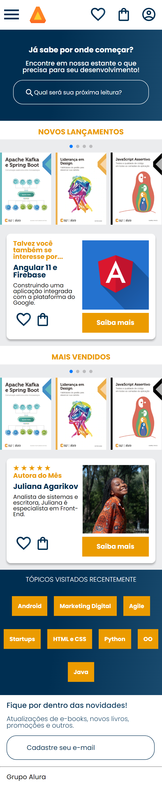

##Projeto Alura-GEEK
Projeto desenovlvido no curso HTML, CSS com mobilie-frist.
o Site é responsivo, e foi utilizado o conceito mobile first.

## Tecnologias utilizadas
* HTML
* CSS
* SwiperJS

[🔗 Clique aqui para acessar.](https://alinechaves2911.github.io/Alurabooks/)
## Imagem do site!

